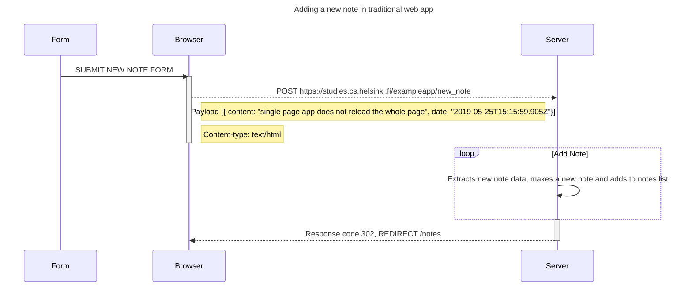
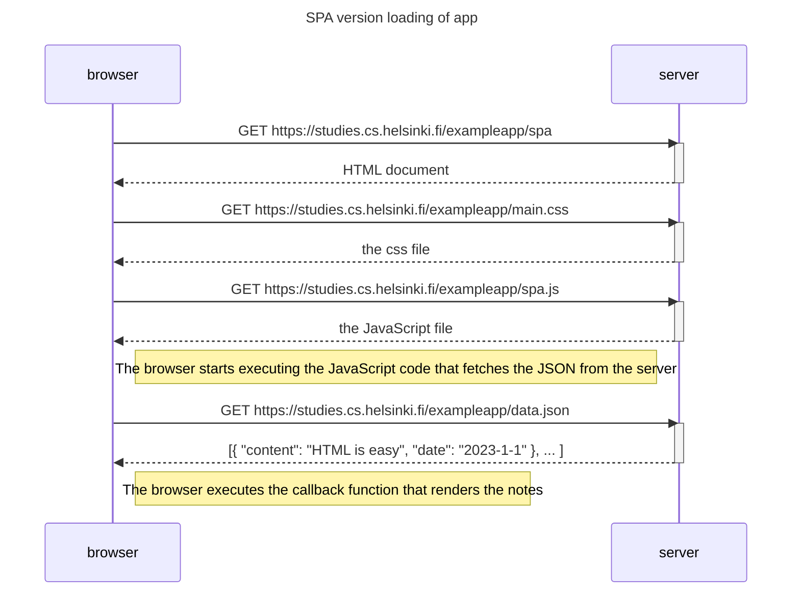
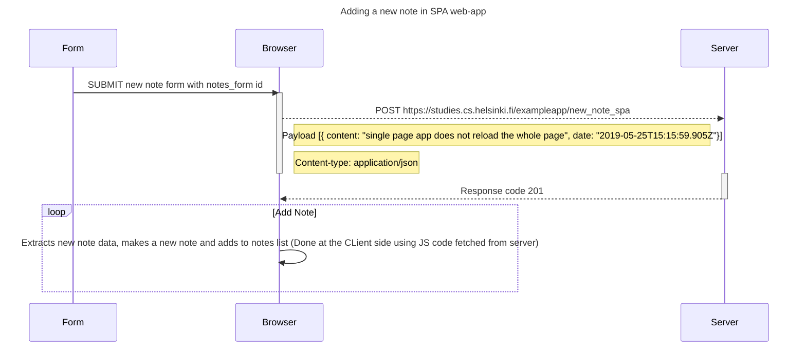

# part0-fullstack
part 0 submission of full stack open course

```mermaid
---
    title: Adding a new note in traditional web app
---
sequenceDiagram
Form->>Browser: SUBMIT NEW NOTE FORM
activate Browser
Browser-->>Server: POST https://studies.cs.helsinki.fi/exampleapp/new_note
Note right of Browser: Payload [{ content: "single page app does not reload the whole page", date: "2019-05-25T15:15:59.905Z"}]
Note right of Browser: Content-type: text/html
deactivate Browser

loop Add Note
    Server->>Server: Extracts new note data, makes a new note and adds to notes list
end

activate Server
Server-->>Browser: Response code 302, REDIRECT /notes
deactivate Server
```

```mermaid
---
    title: SPA version loading of app
---
sequenceDiagram

    browser->>server: GET https://studies.cs.helsinki.fi/exampleapp/spa
    activate server
    server-->>browser: HTML document
    deactivate server

    browser->>server: GET https://studies.cs.helsinki.fi/exampleapp/main.css
    activate server
    server-->>browser: the css file
    deactivate server

    browser->>server: GET https://studies.cs.helsinki.fi/exampleapp/spa.js
    activate server
    server-->>browser: the JavaScript file
    deactivate server

    Note right of browser: The browser starts executing the JavaScript code that fetches the JSON from the server

    browser->>server: GET https://studies.cs.helsinki.fi/exampleapp/data.json
    activate server
    server-->>browser: [{ "content": "HTML is easy", "date": "2023-1-1" }, ... ]
    deactivate server

    Note right of browser: The browser executes the callback function that renders the notes
```

```mermaid
---
    title: Adding a new note in SPA web-app
---
sequenceDiagram
Form->>Browser: SUBMIT new note form with notes_form id
activate Browser
Browser-->>Server: POST https://studies.cs.helsinki.fi/exampleapp/new_note_spa
Note right of Browser: Payload [{ content: "single page app does not reload the whole page", date: "2019-05-25T15:15:59.905Z"}]
Note right of Browser: Content-type: application/json
deactivate Browser

activate Server
Server-->>Browser: Response code 201
deactivate Server

loop Add Note
    Browser->>Browser: Extracts new note data, makes a new note and adds to notes list (Done at the CLient side using JS code fetched from server)
end

```
